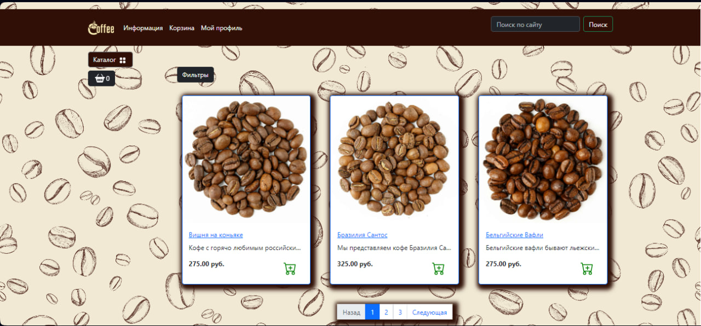

# E-Commerse-dj

This is a simple version of the e-commerce website created with Django.



## Project Summary

The site contains a catalog of products that users can add to their shopping carts.
Users can also place an order, order delivery

## Technologies Used

<p align='center'>


</p>

- Python
- Django
- PostgreSQL 
- Bootstrap
- HTML5

## To install:

Create a .env file on root folder (/root/.env) setting all requirements without using space after "=".

```
# Secret key
SECRET_KEY=SECRET_KEY

# Database settings
DB_ENGINE="django.db.backends.postgresql"
DB_NAME=<name>
DB_USER=<user>
DB_PASSWORD=<password>
DB_HOST="localhost"
DB_PORT="5432"

```

 ## Gratitude
 Special thanks to [PythonHubStudio](https://github.com/PythonHubStudio) for the good Django course.

